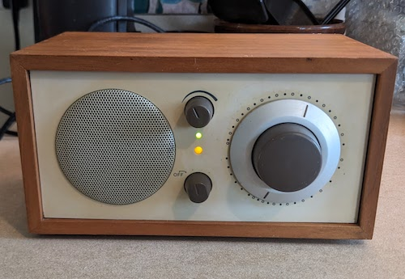

# Model One Internet Radio Appliance

## Overview
This is a streaming radio appliance built inside the chassis of an old [Tivoli Audio Model One Radio](https://tivoliaudio.com/products/model-one-classic-retro-am-fm-table-radio).  The idea is to give 
an analog-like radio experience while playing a fixed selection of streaming stations.

After building this project I realized someone [had done it before](https://hackaday.com/2022/09/22/simple-internet-radio-transplant/) and I probably had seen the Hackaday post and only 
subconsciously remembered it.
I did a few things differently than the builder of that Hackaday post did.  For one, I have a dedicated amplifier board and tied the volume pot directly to that amp, eliminating one of the A/D channels
and allowing smoother volume changes. I also made the on/off switch soft, merely shutting off the front LEDs and silencing the audio.  The on/off/band select switch allows for 3 different
bands of stations.

All electronics in the original radio were removed, and this project retains the following components:

- Wooden Cabinet
- Front and back panels
- Speaker
- Volume knob
- Band switch
- Power and tuning LEDs
- Tuning knob

## Hardware
I used the [Libre Potato](https://libre.computer/products/aml-s905x-cc/) as my main controller. It's similar to a Raspberry Pi 4, which is unobtainable right now.  This board has no WiFi, so a cheap WiFi USB adapter was added.

A USB wall power supply is connected to this [12V USB booster from AdaFruit](https://www.adafruit.com/product/2778).  The 12v powers a [20W stereo amplifier](https://www.adafruit.com/product/1752) from AdaFruit, though I'm only using one stereo channel.

The band select switch originally switched between OFF, FM, AM, and AUX. I ended up needing to cut traces on the band selector PCB to isolate these 3 positions in the switch.  The switch is now connected to GPIOs on the Libre board and is used to choose between three sets of URLs: a set of BBC stations a set of CBC station, and a set of US stations.

The volume control pot is wired directly to the amplifier board.

The tuning knob on the Model one is especially nice. It's big and is geared way down.  It originally was connected to a variable capacitor for RF tuning purposes, but here I've connected it to a 10K potentiometer which is monitored by an [MCP3008 10-bit A/D converter](https://www.adafruit.com/product/856) over SPI.

The power and tuning LEDs on the front panel are driven directly by GPIOs.

## OS Configuration
Since I'm using a Libre Potato board, I chose their version of [Raspbian](https://hub.libre.computer/t/raspbian-11-bullseye-for-libre-computer-boards/82). 

A sound mixer is needed since both the static and radio copies of mplayer are running concurrently and need to switch in and out quickly. Pulseaudio comes pre-installed on Raspbian, but Pulseaudio
isn't designed for headless operation. It normally won't start until a user logs in.  Fortunately the FreeDesktop people provide a [guide](https://www.freedesktop.org/wiki/Software/PulseAudio/Documentation/User/SystemWide/)
for running Pulseaudio as a system (as opposed to user) service.  They do strongly discourage it, but embedded applications like this require it.

As per the guide, I disabled the two PulseAudio user services and created two in the /lib/systemd/system/ directory, with pulse launched with the --system switch.

The radio application itself is also launched as a system service, using a user who was added to the proper pulse user groups.

## Software

The player software is written in Typescript and runs under node.js.  Two special purpose Node modules are used:

- [spi-device](https://www.npmjs.com/package/spi-device) For SPI access to the ADC
- [onoff](https://www.npmjs.com/package/onoff) For GPIO control

I've spent quite a bit of time trying to replicate the feel of tuning an analog radio with this device. Static is played between stations, and the radio tries to "lock onto" nearby stations.  It's still not quite the same experience as with an actual analog radio, though, and I can see this being a never ending source of tweaks.

This radio uses [mplayer](http://www.mplayerhq.hu) to play the actual radio streams. To speed up transitions betwen stations and between stations and static, two mplayer processes are started and kept running forever, one for radio and one to play a wav file contaiing radio static. I start mplayer in slave mode, meaning commands to change the URL and to pause and resume the player are injected into stdin.

Code was composed in [Emacs](https://www.gnu.org/software/emacs/).

